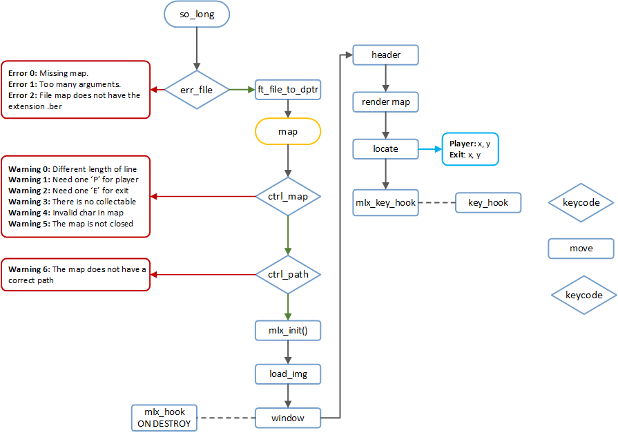

<h1 align="center">
  
  
	so_long
</h1>
 <p align="center">


</p>

<h1 align="center">
<!--  -->
</h1>

## instalar MiniLibX en MacOs

Es necesario tener [homebrew](https://brew.sh/)

Instalar X11.

	brew install Xquartx

Ahora ya podemos descomprimir [minilibx_opengl.tgz](https://github.com/nach131/so_long/blob/main/grafic_lib/minilibx_opengl.tgz) e instalarlo.

	cd minilibx_opengl
	make
	sudo cp mlx.h /usr/local/include
	sudo cp libmlx.a /usr/local/lib
	sudo reboot

Instalar man de MLX en MacOs.

[minilibx-linux](https://github.com/42Paris/minilibx-linux)

	sudo cp minilibx-linux/man/man3/* /usr/share/man/man3/

## MiniLibX

Permite crear software gráfico de una manera sencilla y con simples funciones. Permitiendo dibujar y gestionar imagenes con eventos básicos (teclado, ratón).

flag de compilación.

> -lmlx -lXext -lX11

Para inicialiar la conexión entre el software y la pantalla, asignaremos ```mlx_init```, de esta manera se creara una conexión entre la ventana y los evento realiados por el usuario.

```mlx_ptr``` es el parametro identificador devuelto por ```mlx_int()```

```c
void *mlx_init();
```

## mlx_new_window
```c
void	*mlx_new_window ( void *mlx_ptr, int size_x, int size_y, char *title );

int	mlx_clear_window ( void *mlx_ptr, void *win_ptr );

int	mlx_destroy_window ( void *mlx_ptr, void *win_ptr );
```

La función ```mlx_new_window()``` crea una nueva ventana en la pantalla, utilizando los parametros ```size_x``` y ```size_y``` para determinar el tamaño y `*title` para el título de la ventana.

```mlx_new_window()``` devuelve un indicador de ventana ```void *``` que se pude usar con otras llamadas de MiniLibX, ya que la libreria puede usar un numero arbitrario de ventanas separadas.

`mlx_clear_window() `y `mlx_destroy_window()` respectivamente limpian (en negro) y destruyen la ventana dada.

`mlx_ptr` es el identificador de conexión de pantalla y `win_ptr` es un identificador de ventana.

## mlx_new_image

Control de imagenes.

```c


```
### mlx_new_image()
```c
void	*mlx_new_image ( void *mlx_ptr, int width, int height );
```
Pone una imagen en la memoria, devolviendo un puntero, para poder procesar la imagen, necesita el tamaño de la imagen y el conector de `mlx_ptr`

### XPM images

```c
void	*mlx_xpm_to_image ( void *mlx_ptr, char **xpm_data, int *width, int *height );

void	*mlx_xpm_file_to_image ( void *mlx_ptr, char *filename, int *width, int *height );
```


### mlx_put_image_to_window

```c
int	mlx_put_image_to_window ( void *mlx_ptr, void *win_ptr, void *img_ptr, int x, int y );
```
La imagen se podra mostrar en cualquier ventana especificando el identificador de la conexión, la ventana y la imagen `(mlx_ptr, win_ptr, and img_ptr)` con  `mlx_put_image_to_window() `, son necesarios las cordenadas x,y para definir donde debe colocarse la imagen.

### mlx_get_data_addr()
```c
char	*mlx_get_data_addr ( void *img_ptr, int *bits_per_pixel, int *size_line, int *endian );
```
Devuelve información sobre la imagen para poder ser manipulada, `img_ptr` especifica la imagen a usar.

`bits_per_pixel` se llenara con el número de bits necesarios para representrar un color de pixel.

`size_line` es el número de bytes necesarios para almacenar una línea de la imagen en la memoria, es necesario para poder moverse de una línea a otra en la imagen.

`endian` el color de pixel de la imagen debe almacenarse en little endian (endian == 0) o big endian (endian == 1)

Devuelve una dirección de `char *` que representa el comienzo del área de momoria dende se almacena la imagen.

Apartir de esta dirección, los primeros `bits_per_pixel` representan el color del primer pixel en la primera linea de la imagen.

El segundo grupo de `bits_per_pixel` representan el segundo pixel de la primera línea y asi...

### int	mlx_destroy_image()
```c
int	mlx_destroy_image ( void *mlx_ptr, void *img_ptr );
```
Destruye la imagen pasada por `img_ptr`

## mlx_loop
: handle keyboard or mouse events

### mlx_get_color_value()
```c
unsigned int	mlx_get_color_value ( void *mlx_ptr, int color );
```
Para control el color de píxel, (no lo uso).

Convertir png a xpm en linux

	sudo apt install imagemagick

	convert a.png x.xpm
	convert x.xpm aa.png

	para uno
	convert fotograma-000002.png -depth 8 -colors 256 -colorspace RGB -define XPM:color-format='6c' -define XPM:sort=True -define XPM:string=1 -define XPM:mime=1 fotograma-000002.xpm

para toda una carpeta
	 for file in *.png; do convert  $file $file.xpm; done
	 for f in */*.bmp ; do convert $f ${f%bmp}png; done

//================Nach way...=========COLORES CORRECTOS=======================================
para todos los png que hay en una carpeta
 for file in *.png; do convert $file -depth 8 -colors 256 -colorspace RGB -define XPM:color-format='6c' -define XPM:sort=True -define XPM:string=1 -define XPM:mime=1 $file.xpm; done
 //===========================================================================================

"$f" is the original input filename
"${f}" is the same, just a different way of accessing the variable
"${f%%.bmp}.png" uses string replacement – f%%.bmp means, delete the longest match of .bmp from the back of $f.

para mac
$ brew info imagemagick
$ brew install imagemagick

https://imagemagick.org/script/download.php


for file in *.png; do convert depth 8 -colors 256 -colorspace RGB -define XPM:color-format='6c' -define XPM:sort=True -define XPM:string=1 -define XPM:mime=1 $file $file.xpm; done